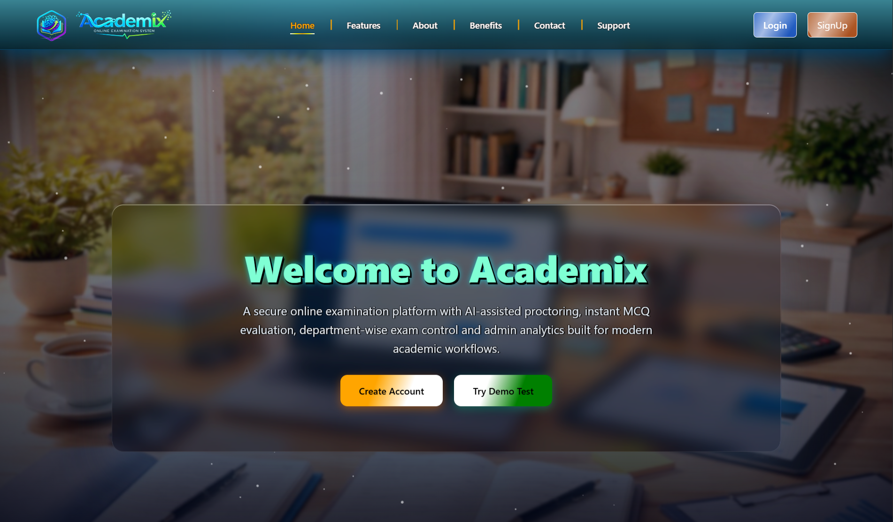

# 🚀 Academix — Smart Online Examination System

  
  
  
  

«Academix is a modern, secure, and scalable online examination platform designed for educational institutions.
It provides real-time analytics, automated grading, and seamless exam management.»

---

🌐 Live Demo

🔗 Visit the website:👉 https://academix.free.je/

---

✨ Features

🎓 Student Panel

- 📝 Attempt exams with timer
- 📊 View results & performance analytics
- 🏆 Leaderboard system (Top performers)
- 👤 Profile management
- 🔒 Secure exam environment

🛠 Admin Panel

- 📚 Create & manage exams
- ❓ Question bank system
- 📈 Analytics dashboard (charts & reports)
- 👥 Student management
- 🏅 Top-performing students tracking

⚡ Core System

- ⏱ Timed exams with auto-submit
- 📊 Auto grading system
- 🔐 Authentication & role-based access
- 📱 Fully responsive UI
- 🎨 Modern glassmorphism UI design

---

🧠 Tech Stack

Layer| Technology
Backend| Laravel (PHP)
Frontend| Blade + Tailwind CSS
Database| MySQL
Charts| Chart.js
Auth| Laravel Breeze
Build Tool| Vite

---

🔐 Default Roles

Role| Access
Admin| Full system control
Student| Exam & dashboard

---

📸 Screenshots

🏠 Landing Page

Modern glass UI with animated effects

📊 Dashboard

Performance tracking & analytics

🏆 Leaderboard

Top students with ranking system

---

🚀 Future Improvements

- 🤖 AI Proctoring
- 📹 Webcam monitoring
- 📊 Advanced analytics
- 🌍 Multi-language support
- 📱 Mobile App (Flutter)

---

🧑‍💻 Author

Akash Pramanik
📧 academix.edutech@gmail.com

---

⭐ Support

If you like this project, give it a ⭐ on GitHub!

---
