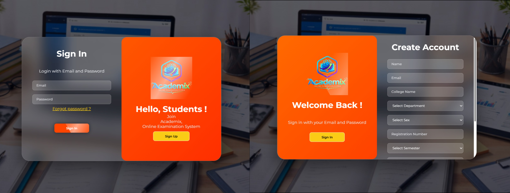

# 🚀 Academix — Smart Online Examination System

<p align="center">
  
  
  
  
</p>

## Overview

Academix is a modern online examination system built with Laravel, Tailwind CSS, and Blade. It supports both administrative and student workflows with strong security, exam analytics, AI-assisted question generation, and auto-grading.

- Optimized for educational institutions, departments, and semesters
- Secure role-based access for admins and students
- Built-in AI and Cloudinary integrations for richer exam operations
- Responsive UI with polished dashboard and reporting experiences

---

## 🌐 Live Demo

### Guest Landing Page
<p align="center">
  
</p>

### Log in & Sign up Page

<p align="center">
  
</p>


### Admin Panel

<p align="center">
  
  
<br>
  
  
<br>

  
</p>

### Student Panel

<p align="center">
  
  
<br>
  
  
<br>

  
</p>

- 👉 Website URL : https://academix.free.je
---

## 🔥 Key Benefits

- Faster exam preparation and delivery for admins
- Real-time student exam monitoring and auto-save
- Accurate auto-grading with question-level scoring and negative marking
- Rich analytics for student performance, weak topics, and top performers
- AI-assisted question generation and result analysis
- Secure exam submission with violation reporting and audit support
- Lightweight installation with Laravel Breeze and Vite

---

## ✨ Features

### Admin Features

- ✅ Create, publish, and manage exams
- ✅ Build exam question banks and multiple choice options
- ✅ Use AI to generate draft questions, then review and approve
- ✅ Review AI analytics insights for exam performance
- ✅ Approve or reject student profile change requests
- ✅ Manage student accounts, status, and department access
- ✅ View exam performance reports and question analysis
- ✅ Track violations and view violation images
- ✅ Filter analytics by department and semester
- ✅ Built-in admin dashboard with exam, student, and result summaries

### Student Features

- ✅ Browse published exams by department and semester
- ✅ Start exams with timing, auto-save, and resume support
- ✅ Submit answers and receive instant scoring
- ✅ View result summaries with percentage and pass/fail status
- ✅ Access AI-powered result analysis and AI chat for feedback
- ✅ Manage profile information and request academic changes
- ✅ Report exam violations through the UI

### Core System Capabilities

- ✅ Role-based authentication with admin/student separation
- ✅ Exam auto-submit and duplicate attempt prevention
- ✅ Answer autosave / draft recovery while taking exams
- ✅ Question-level scoring with optional negative marking
- ✅ Student dashboard with exam counts and success metrics
- ✅ Admin analytics for top students, weak topics, and difficult questions
- ✅ Cloudinary profile and violation image upload support
- ✅ Gemini AI support for question generation and analytics
- ✅ Fully responsive interface using Tailwind CSS and Flowbite

---

## 🧱 Tech Stack

- PHP 8.2+
- Laravel 12
- Blade templates
- Tailwind CSS + Flowbite
- Vite build tool
- SQLite / MySQL compatible
- Laravel Breeze authentication
- Composer + npm tooling

---

## 🚀 Quick Start

### 1. Clone the repository

```bash
git clone https://github.com/akash098p/Online-Examination-System.git
cd Online-Examination-System
```

### 2. Install PHP dependencies

```bash
composer install
```

### 3. Install frontend dependencies

```bash
npm install
```

### 4. Copy environment file

```bash
copy .env.example .env
```

### 5. Generate app key

```bash
php artisan key:generate
```

### 6. Configure `.env`

Update these values as needed:

```env
APP_NAME=Academix
APP_URL=http://localhost
DB_CONNECTION=sqlite
DB_DATABASE=/full/path/to/database/database.sqlite
QUEUE_CONNECTION=database
SESSION_DRIVER=database
MAIL_MAILER=log
CLOUDINARY_CLOUD_NAME=
CLOUDINARY_API_KEY=
CLOUDINARY_API_SECRET=
GEMINI_API_KEY=
GEMINI_MODEL=gemini-2.5-flash
```

> If you prefer MySQL, set `DB_CONNECTION=mysql` and update `DB_HOST`, `DB_PORT`, `DB_DATABASE`, `DB_USERNAME`, and `DB_PASSWORD`.

### 7. Run migrations and seeders

```bash
php artisan migrate --seed
```

### 8. Build assets

```bash
npm run build
```

### 9. Start the application

```bash
php artisan serve
```

Then open `http://127.0.0.1:8000` in your browser.

---

## 🧪 Local Development

For development with auto-reload:

```bash
npm run dev
```

If you want the full Laravel + Vite experience, use the composer `dev` script:

```bash
composer run dev
```

---

## 👤 Default Seeded Accounts

The database seeder creates default users:

- Admin: `admin@example.com` / `password`
- Student: `student@example.com` / `password`

---

## ⚙️ Environment Variables

The project supports these environment settings:

- `APP_NAME`, `APP_ENV`, `APP_URL`, `APP_DEBUG`
- `DB_CONNECTION`, `DB_HOST`, `DB_PORT`, `DB_DATABASE`, `DB_USERNAME`, `DB_PASSWORD`
- `SESSION_DRIVER`, `QUEUE_CONNECTION`, `CACHE_STORE`
- `MAIL_MAILER`, `MAIL_HOST`, `MAIL_PORT`, `MAIL_USERNAME`, `MAIL_PASSWORD`
- `CLOUDINARY_CLOUD_NAME`, `CLOUDINARY_API_KEY`, `CLOUDINARY_API_SECRET`
- `GEMINI_API_KEY`, `GEMINI_MODEL`, `AI_CACHE_MINUTES`, `AI_ANALYTICS_CACHE_MINUTES`, `AI_RATE_LIMIT_PER_HOUR`

---

## 📁 Useful Commands

```bash
composer install
npm install
php artisan migrate --seed
npm run build
npm run dev
php artisan test
```

---

## 🧩 Project Structure

- `app/` — Models, Controllers, Services, Middleware
- `config/` — Laravel and application configuration
- `database/` — Migrations, seeders, factories
- `resources/views/` — Blade templates
- `public/` — Public assets and image files
- `routes/` — Route definitions for web, auth, admin, student

---

## 💡 Notes

- The app currently ships with AI-driven question generation and analysis via Gemini.
- Cloudinary integration is available for profile photos and violation evidence.
- Use `MAIL_MAILER=log` for local development to avoid email configuration issues.

---

## 🙌 Contribution

If you want to extend Academix, feel free to add:

- proctoring and webcam monitoring
- multi-language support
- mobile app synchronization
- advanced AI exam review and grading

---

## 📬 Contact

<h3>Akash Pramanik</h3>

<p>
  <strong>For questions or support: </strong>
<a href="https://instagram.com/akash.098p" target="_blank">
  
</a> 

<a href="mailto:akashpramanik098@gmail.com">
  
</a>
</p>
